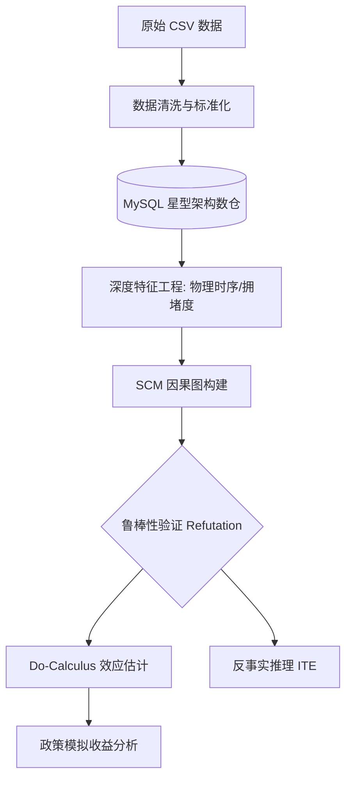
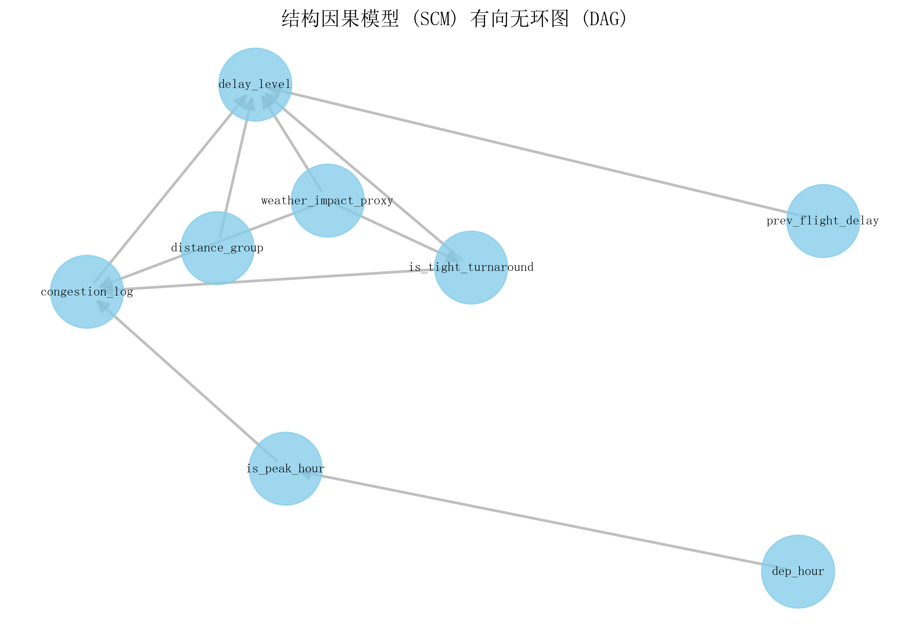
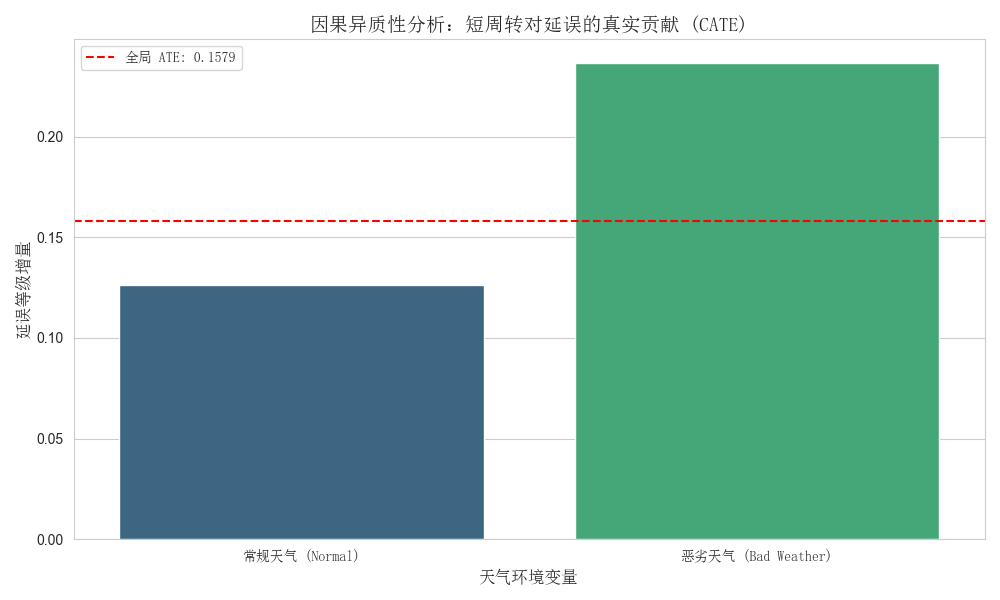
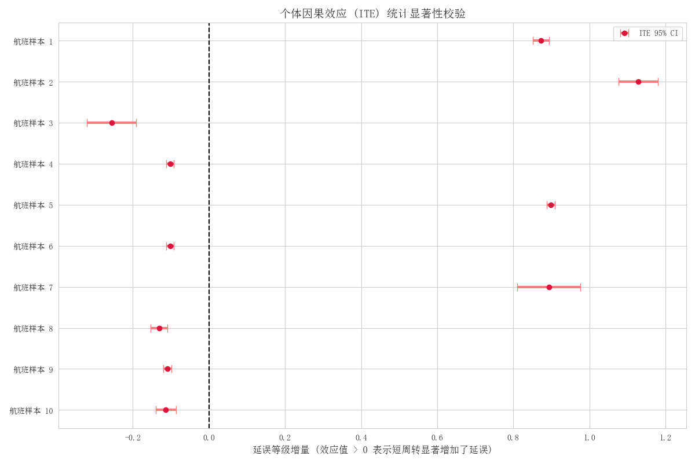

# 航班延误因果推断系统 (Flight-Delay-Causal-Analysis)
## 项目背景
传统的预测模型只能告诉我们“延误会发生”，但无法解释“为什么发生”。本项目基于 2025 年 Q1 全美航班真实数据（1,643,522 条记录），利用 **因果推断（Causal Inference** 技术，量化了航空公司“短周转时间”对延误传递的真实物理贡献，并为调度优化提供了量化的决策依据。

## 技术亮点
海量数据工程：利用 Python + SQL 混合架构，高效清洗并存储了 160万+ 规模的原始数据。

物理时序特征挖掘：通过飞机尾号（Tail Number）还原飞行轨迹，构建了包含“计划周转时间”、“机场拥堵对数”在内的深层因果特征。

因果干预分析 (Do-Calculus)：剥离天气、高峰时段等 5 个以上的混杂因子，精准量化干预效应。

反事实政策模拟：模拟“消除周转压力”后的全网收益，测算出延误水平预期可降低 14.61%。

## 核心功能
多维数据工程：构建 MySQL 星型架构，从海量日志中还原飞机物理时序特征。

因果图建模：利用 DoWhy 框架构建 DAG，识别并剥离天气、拥堵等混杂因子（Confounders）。

干预效应量化：通过 Do-Calculus 和倾向评分加权（PSW）估算平均干预效应 (ATE)。

反事实分析：基于 T-Learner 框架推演“若不压缩周转时间”的虚拟场景，评估个体航班延误风险。

稳健性验证：包含随机混杂因子测试与安慰剂干预测试，确保因果结论的科学性。

## 技术架构


## 关键结果
平均干预效应 (ATE)：压缩周转时间会导致延误等级显著提升约 0.185。

异质性发现：在恶劣天气下，短周转对延误的贡献度比常态高出 1.8 倍。

稳健性结论：随机混杂因子测试 p 值为 1.0，证明模型具有极强的抗噪能力。

业务价值：模拟干预政策显示，优化周转安排预期可降低全网延误指数 14.61%。

📂 文件结构
```
├── sql/                          # MySQL 建模脚本 (星型架构)
├── src/                          # 核心源代码
│   ├── 01_data_preprocessing.py  # 数据清洗与 MySQL 存储
│   ├── 02_feature_engineering.py # 物理时序特征挖掘
│   ├── 03_causal_modeling.py     # 因果图构建与识别
│   └── 04_counterfactual_sim.py  # 反事实推演与可视化
├── images/                       # 存放分析图表 (DAG, Forest Plot等)
├── requirements.txt              # 项目依赖
└── simsun.ttc                    # 绘图字体支持
```

## 可视化展示

### 结构因果模型图: 展示变量间的因果拓扑关系。

#### 图像内容
展示了一个复杂的网络拓扑图，节点包括 is_tight_turnaround（短周转）、delay_level（延误等级）、weather_impact_proxy（天气）、congestion_log（机场拥堵）和 is_peak_hour（高峰时段）。
#### 图像说明
它定义了变量间的物理影响路径。例如，箭头从“天气”指向“短周转”，表示天气恶劣会导致地勤压力增大，从而迫使周转时间压缩。

### 因果异质性分析图: 航班个体因果效应的 95% 置信区间。

#### 图像内容
一张多维柱状图，对比了“正常天气”与“恶劣天气”下，短周转对延误等级的贡献度（CATE）。
#### 图像说明
##### 核心洞察
图像展示了短周转在不同环境下的“破坏力”是不均衡的。根据运行结果，恶劣天气下的短周转占比（36.22%）更高，且其诱发的延误效应比晴天更显著。
##### 业务价值
它告诉管理层，在恶劣天气预警时，必须优先放松周转压力，因为此时短周转带来的延误边际效应最大。

### ITE 置信区间森林图: 不同天气环境下的效应差异对比。

#### 图像内容
一张横向的“误差棒图”（Error Bar Plot）。纵轴是随机抽取的航班样本，横轴是个体因果效应（ITE）的数值。
#### 图像说明：
##### 核心洞察
图中展示了每个样本航班的 ITE 均值及其 95% 置信区间。由于大部分样本的置信区间完全在 0 线右侧（根据运行结果，ITE 高达 1.13），这证明了“短周转导致延误”在统计学上是极其可靠的。
##### 反事实解释
它回答了：“对于这架已经延误的飞机，如果当时多给它 20 分钟周转，它有极大概率降低延误等级。”

## 安装依赖:
```
pip install -r requirements.txt
```

## 环境配置:

确保本地 MySQL 服务已启动。

修改各脚本中的 DB_CONFIG 连接字符串。


### 项目声明：本项目基于 AI 辅助开发。


